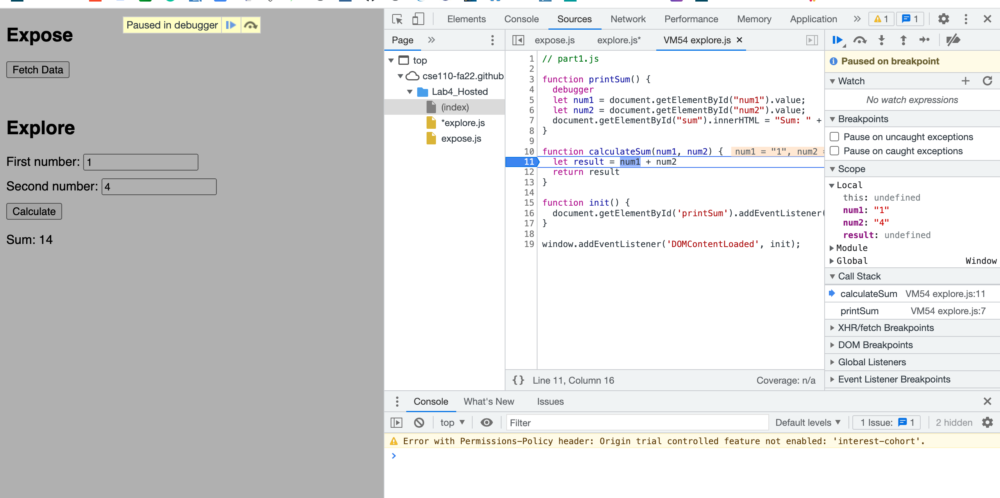
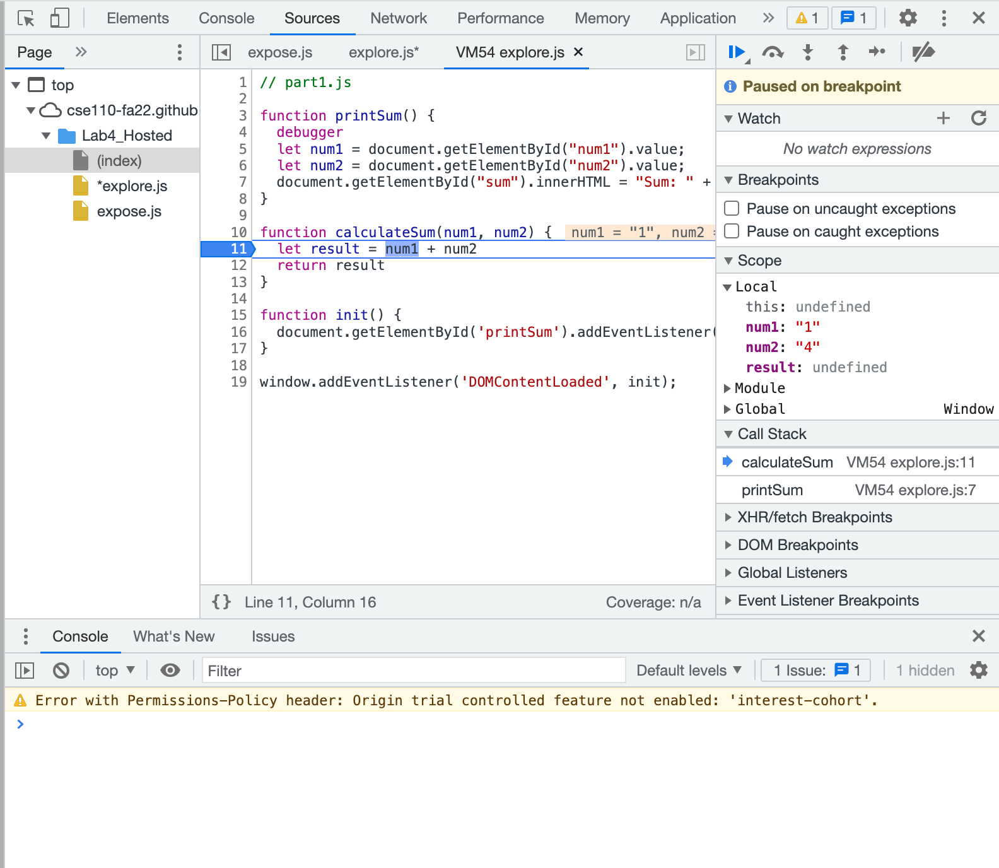
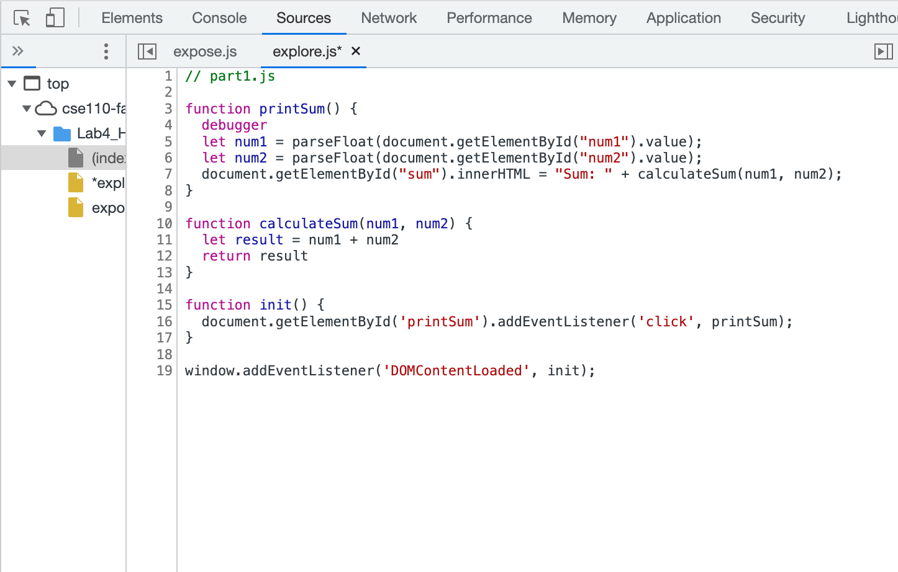

debugging process:

1. the bug is the program see the num1 and num2 as a string not a number type. So, the result is not addition of two numbers, but connect 2 strings together.
2. convert the string to number type
   